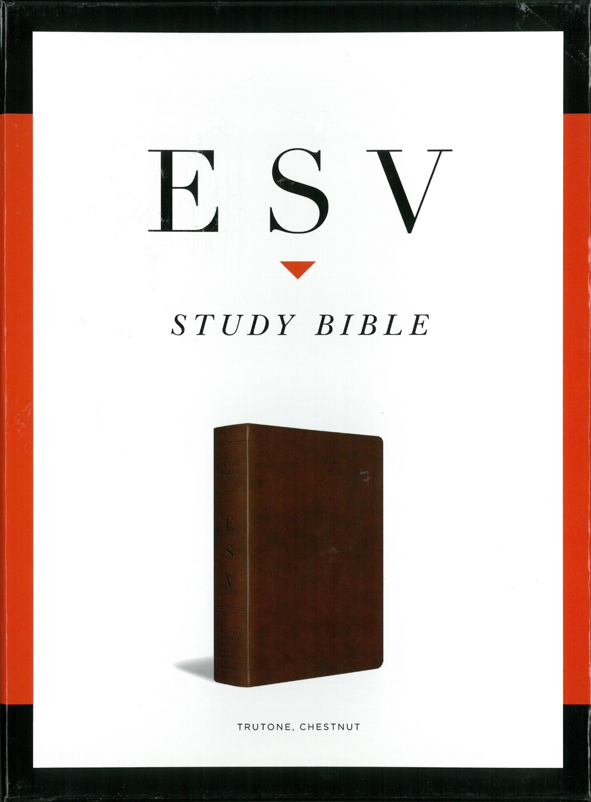
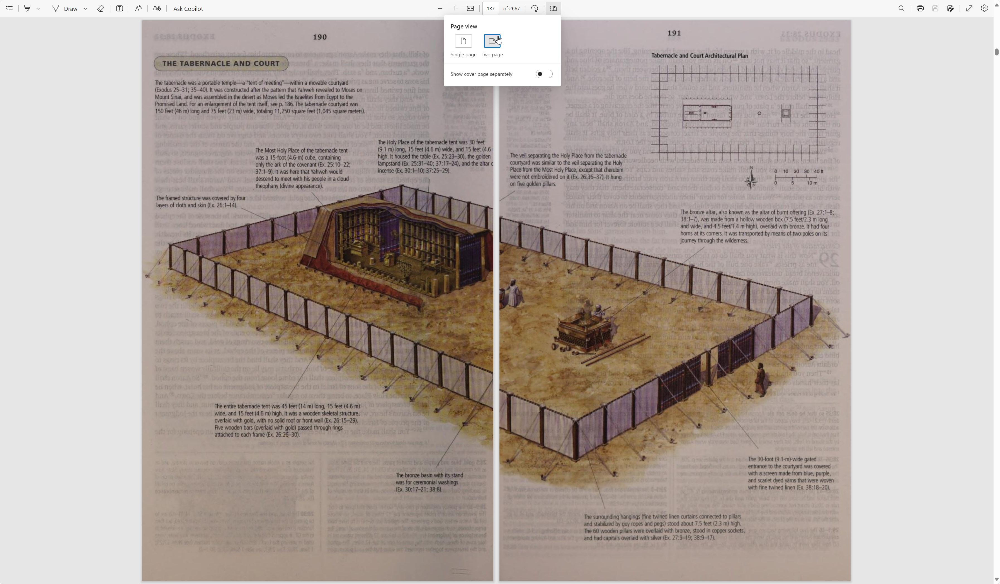

<div align="center">
  
</div>

[**Download PDF**](https://drive.google.com/uc?export=download&id=1d5LllnULOlaHQloJCKyS3qj-o0IPHKOS)

> Recommended to read in two-column (two-page or landscape or horizontal) layout (orientation). Microsoft Edge web browser has this feature built-in, some other web browsers might too. See example why its useful and how to enable it in Edge in the image below.


#### Repository Folder Structure
```
automations/
└── Python files that help automate some tedious tasks...
images/
└── some miscellaneous images that are used in the repository...
pages/
└── all pages of the ESV Study Bible Book in JPEG image format...
```

#### Access all ESV.org resources for free
> If you're **not** in 🇺🇸 USA, 🇬🇧 UK, 🇨🇦 Canada, or 🇦🇺 Australia, all the ESV resources, including the ESV Study Bible, are available for free

1. Have an ESV.org account
2. Go [here](https://www.ESV.org/international/) and fill out the little form
	
1. Read the Holy Bible and praise Jesus Christ our Holy Lord GOD Almighty ✝️💟🙏
